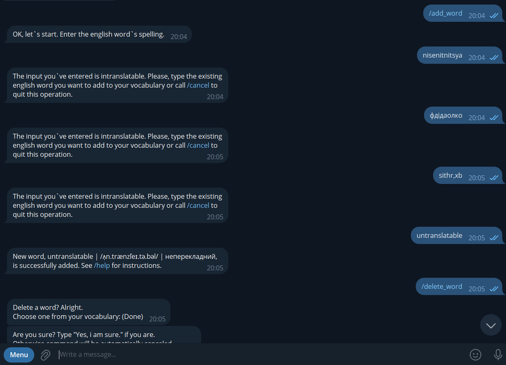
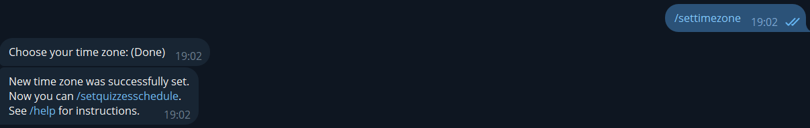
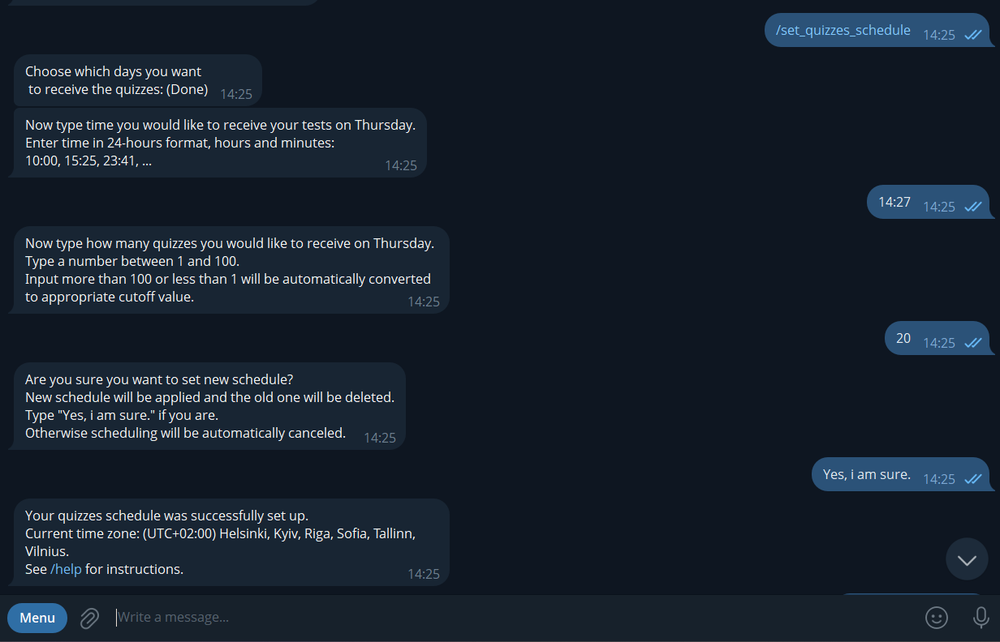
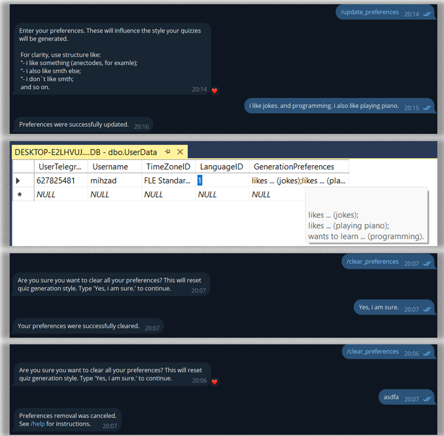
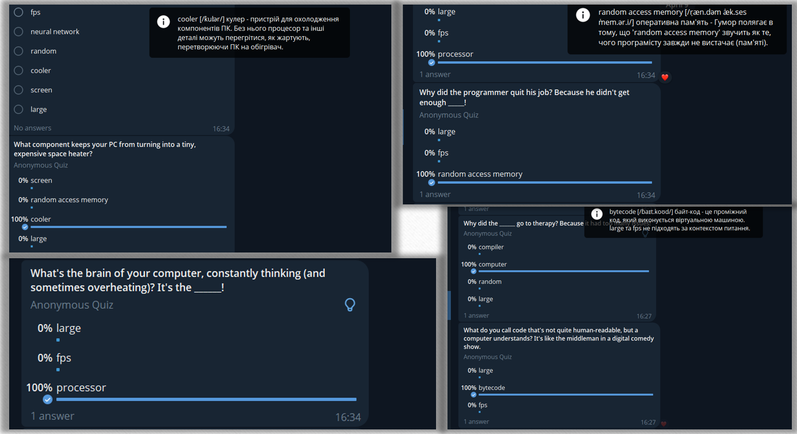

English Vocabulary Quizzes telegram bot, powered with Gemini for quiz generation and Quartz for flexible schedule setup.

# Working principle and illustrations 
0) User selects his/her native language.
1) User enters a set of words he/she wishes to practice (LLM will help with transcriptions and translations).

3) User sets the time zone and test schedule (what days of week and what o`clock each day to send tests); also count of generated test and other settings.

5) (additional) User sets his/her preferences - what quiz themes he/she does or doesn't want to hear;

7) Bot generates tests using:
   
   a) specified vocabulary - tests are directed to help learn the vocabulary and contain the words you add to your vocabulary;
   
   b) specified generation preferences - if someone entered that he`s e.g. an engineer and/or likes jokes - LLM will try to bring engineering and jokes into the quiz;
   
   c) specified schedule - quizzes are generated and sent at specified day and time only.

# Generated quizzes showcase

